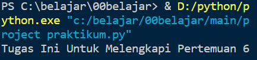
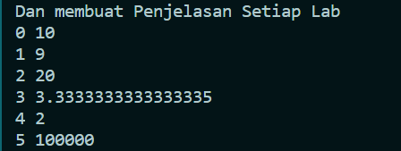

# Tugas Ini Untuk Melengkapi Pertemuan 6  
## Dan Menjelaskan Project  

**NAMA : Abdul Aziz Anaoval**  
**NIM : 312010049**  
**KELAS : TI.20.A.1**  
**TUGAS : BAHASA PEMOGRAMAN**  

### Pengertian print
* Fungsi print("") berfungsi untuk *mencetak* atau *menampilkan objek* ke perangkat keluaran (layar) atau ke file teks.  
> `print`  

* Hasil print

### Bitwise (,)

* Bitwise adalah operator khusus untuk menangani operasi logika bilangan biner dalam bentuk bit.

* Hasil Output 

### Aritmatika dalam bahasa pemograman 
* Aritmatika Terdiri dari 6 Oprator Dan Symbol  
> `Penjumlahan (+)`  
> `Pengurangan (-)`  
> `Perkalian (*)`  
> `Pembagian (/)`  
> `Sisa Bagi (%)`  
> `Pemangkatan (**)`  

* Jadi berhubung menggunakan pemangkatan mari kita lihat contoh di bawah

* Setelah di run

