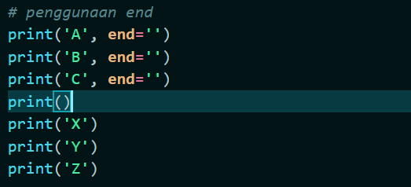
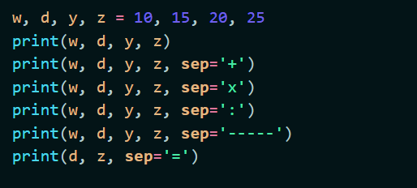

# Tugas Ini Untuk Melengkapi Pertemuan 6  
## Dan Menjelaskan Project  

**NAMA : Abdul Aziz Anaoval**  
**NIM : 312010049**  
**KELAS : TI.20.A.1**  
**TUGAS : BAHASA PEMOGRAMAN**  

*KOLOM 1*  

*STRING FORMAT 1*  
 
### Pengertian print

* Fungsi print("") berfungsi untuk *mencetak* atau *menampilkan objek* ke perangkat keluaran (layar) atau ke file teks.  
* > `print`  

* Hasil print

### Bitwise (,)

* Bitwise adalah operator khusus untuk menangani operasi logika bilangan biner dalam bentuk bit.

* Hasil Output 

### Aritmatika dalam bahasa pemograman 
* Aritmatika Terdiri dari 6 Oprator Dan Symbol berikut **PENJELASAN DI BAWAH INI**  
* > `Penjumlahan (+)`  
* > `Pengurangan (-)`  
* > `Perkalian (*)`  
* > `Pembagian (/)`  
* > `Sisa Bagi (%)`  
* > `Pemangkatan (**)`  

* Dan sekkarang kita coba semua oprator/symbol ditas

* Setelah di run

  

# KOLOM 2

### Penggunaan (END)

* Jadi Penggunaan **end** adalah, Untuk menyatukan semua variabel seperti contoh  

  

* Setelah menjalankan  

  

### Penggunaan separtor

* > `w, d, y, z = 10, 15, 20, 25`  
* w 10  
* d 15  
* y 20  
* z 25  

## Pengertian SEP

* sep adalah pemisah(separator) yang berfungsi sebagai tanda pemisah antar objek yang dicetak. Defaultnya adalah tanda spasi. Seperti contoh di bawah

  

* Dan bisa di liat setelah memasukan sep='+', dan di setiap angka ada +

