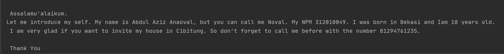
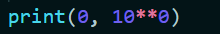
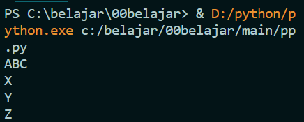
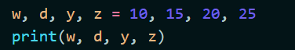

# Tugas Ini Untuk Melengkapi Pertemuan 6 <br>
## Dan Menjelaskan Project <br>

**NAMA : Abdul Aziz Anaoval** <br>
**NIM : 312010049** <br>
**KELAS : TI.20.A.1** <br>
**TUGAS : BAHASA PEMOGRAMAN** <br>

### DAFTAR ISI <br>

| NO | Description | Link |
 
| ----- | ----- | ---- |

| 1. | Pertemuan 5 | [click here] |(#pertemuan - 5) 

## Pertemuan 5 - Latihan

Pada pertemuan 5 bahasa pemograman, saya diberi soal untuk latihan oleh Dosen untuk membuat Aplikasi Biodata dengan python (Seperti gambar di bawah ini:)

Saat ini saya akan menjelaskan hasil dari tugas tersebut. <br>
Berikut *source code* nya atau klik berikut ([latihan 5](tugas5.py)): <br>

``` python
print("Please enter your full name : ")
fullname=input()
print("Please enter nickname : ")
nickname=input()
print("Please enter your NPM : ")
npm=int(input())
print("Please enter your place of birth : ")
pob=input()
print("Please enter your date of birth : ")
date=int(input())
print("Pleae enter your month of birth : ")
month=input()
print("Please enter year of birth : ")
year=int(input())
print("Please enter your phone number : ")
phone=int(input())
print("Please enter your address : ")
address=input()

dob=2020-year

print("\n\n Assalamu'alaikum. ")
print(f"Let me introduce my self. My name is {fullname}, but you can call me {nickname}. My NPM {npm}. I was born in {pob} and Iam {dob} years old. I am very glad if you want to invite my house in {address}. So don't forget to call me before with the number {phone}. \n\n Thank You ")
```
* Berikut penjelasan :<br>
``` python
print("please your full name : ")
```
source code fiatas berfungsi untuk mencetak hasil / output berupa " **please enter your full name :** ". <br>
 Untuk menampilkan output string, saya menggunakan *tanda petik dua* didalam fungsi print(), sedangkan jika saya ingin menampilkan output / hasil berupa angka / interger saya tidak perlu menggunakan *tanda petik dua*. Contohnya:
 ``` python 
 print("nama saya adalah ...")
print(1801)
```
<br>(Seperti gambar berikut ini <br>)
 <br>
* Untuk source code berikutnya adalah inputan atau membuat variable. Seperti syntax dibawah ini:

``` python
fullname=input()
```
Keterangan : <br>
1. Variable adalah sebuah wadah penyimpanan data pada program yang akan digunakan selama program itu berjalan. Yang berfungsi sebagai variable dalam source code diatas adalah **fullname** . <br>

2. Fungsi **input()** adalah untuk memasukan nilai dar layar console di command prompt, lalu kemudian mengembalikan nilai saat kita menekan tombol enter *(newline)* <br>
 <br>
Pada gambar diatas, hasil dari inputan tersebut berwarna *putih* <br>
* Untuk memasukan printah lain seperti *Nickname, NPM, Place of bircth, Date of bircth, Year of bircth, Phone number, and address* mengikuti perintah yang sama seperti memasukan *fullname* <br>

* Untuk menghitung rumus umur saya menggunakan variable *DOB* yaitu 2020 (Tahun sekarang) dikurangi dengan Year of bircth, pada source code berikut : <br>
``` python
dob=2020-year
```
Pada syntax / source code diatas, saya menggunakan variable *dob* dimana untuk menghitung umur (variable **age** pada output), yaitu dengan rumus pada variable *dob=2020-year* <br>

* Langkah kali ini saya akan menampilkan output yang diminta oleh Dosen. <br>
Output pertama yang di minta Dosen adalah menampilkan salam, yaitu dengan mengetikkan syntax / source code berikut : 
``` python
print("\n\n Asalammualaikum.")
```
Keterangan :
1. Fungsi **\n** pada source code diatas adalah untuk memberi baris baru / enter / *newline*
2. Fungsi print() seperti dijelaskan pada point **Output** diatas
Hasil source code diatas adalah seperti gambar dibawah ini : <br>


* Langkah terakhir menampilkan semua hasil


### Pengertian print

* Fungsi print("") berfungsi untuk *mencetak* atau *menampilkan objek* ke perangkat keluaran (layar) atau ke file teks. <br>
* > `print` <br>


* Hasil print


### Bitwise (,)

* Bitwise adalah operator khusus untuk menangani operasi logika bilangan biner dalam bentuk bit.



* Hasil Output 


### Aritmatika dalam bahasa pemograman 
* Aritmatika Terdiri dari 6 Oprator Dan Symbol berikut **PENJELASAN DI BAWAH INI** <br>
* > `Penjumlahan (+)` <br>
* > `Pengurangan (-)` <br>
* > `Perkalian (*)` <br>
* > `Pembagian (/)` <br>
* > `Sisa Bagi (%)` <br>
* > `Pemangkatan (**)` <br>

* Dan sekkarang kita coba semua oprator/symbol ditas


* Setelah di run

 <br>


# KOLOM 2

### Penggunaan (END)

* Jadi Penggunaan **end** adalah, Untuk menyatukan semua variabel seperti contoh <br>

 <br>

* Setelah menjalankan <br>

 <br>


### Penggunaan separtor

* > `w, d, y, z = 10, 15, 20, 25` <br>
* w 10 <br>
* d 15 <br>
* y 20 <br>
* z 25 <br>



## Pengertian SEP

* sep adalah pemisah(separator) yang berfungsi sebagai tanda pemisah antar objek yang dicetak. Defaultnya adalah tanda spasi. Seperti contoh di bawah

 <br>

* Dan bisa di liat setelah memasukan sep='+', dan di setiap angka ada +


